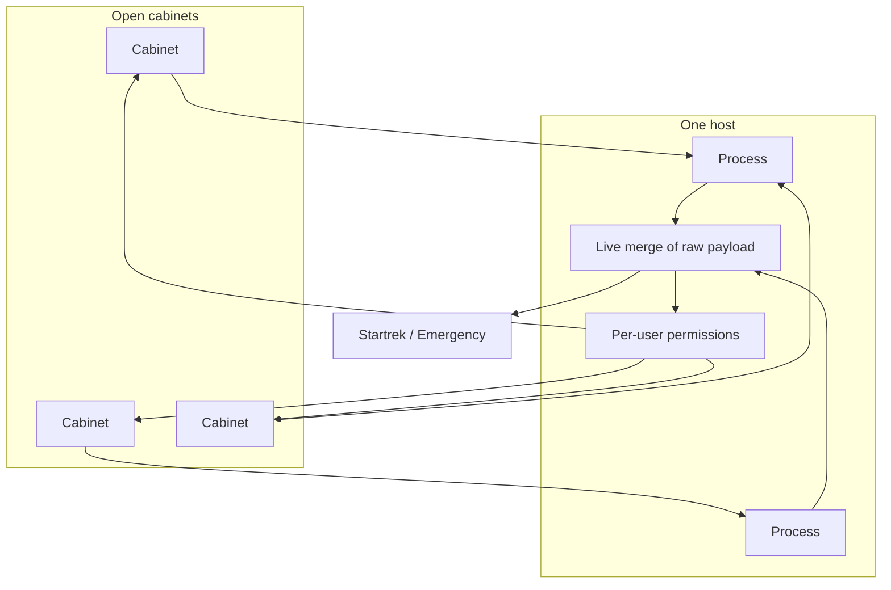
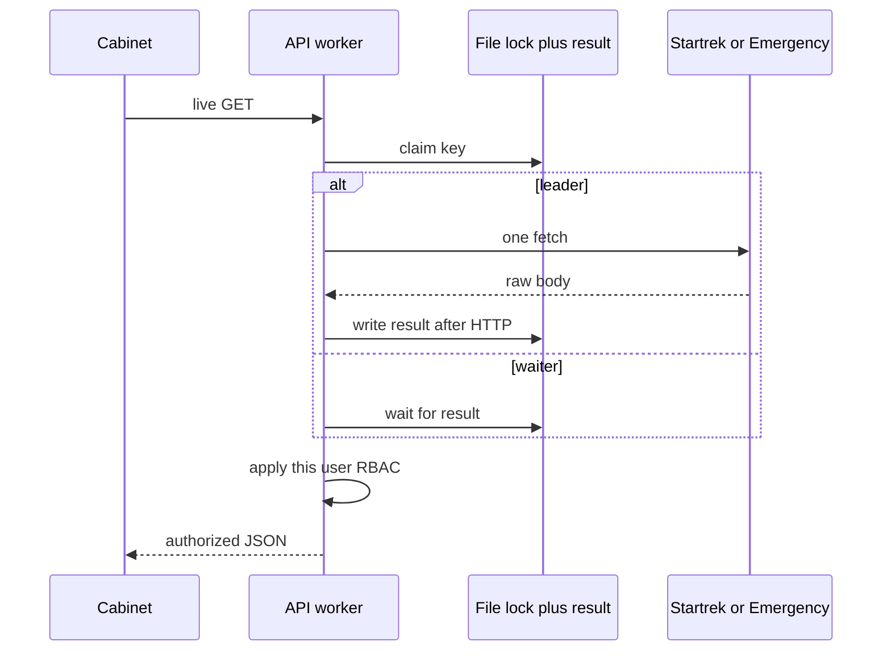

# Shared Host Concurrency - Plan

## Goal Capsule

- **Objective:** One local Robopark host, reached through Tuna, stays usable when up to 200 shift cabinets are open at once: live Tracker/Emergency data without a stampede, and a heavy screen does not freeze the host for everyone else.
- **Product authority:** This plan owns shared-host concurrency for the shift cabinet. Multi-login as a product goal, a second Tracker budget, multi-machine clustering, and Tuna product limits are surrounding work, not this contract.
- **Stop:** Hard session caps, browser-direct Tracker/Emergency, moving system of record off the host, visual-language redesign, guaranteeing live Tracker for every neighbor while one cabinet burns Startrek.
- **Execution profile:** Code. Prove cross-process merge with overlapping requests before turning on extra API workers in Docker.
- **Authority:** Product Contract R-IDs win on behavior. KTDs win on mechanism. Units override neither.
- **Open blockers:** None.
- **Product Contract preservation:** Product Contract unchanged.

---

## Product Contract

### Summary

A single home host behind Tuna serves up to 200 open operator/mechanic cabinets on dashboard, tasks, reports, and emergency.
Identical live Startrek and Emergency reads — including home-screen park counts — merge so upstream is not hit once per cabinet.
Merge shares the raw upstream payload; each user's permissions apply on the way out.
Several processes keep the host answering (shell, reports, cached paint) when one page is heavy; neighbors' live Tracker may wait on the shared pipe.
There is no hard 201st-user cutoff.

### Problem Frame

The cabinet already runs on one host with a Tuna HTTPS tunnel and SQLite.
Shift work will open many cabinets at once against the same Tracker and Emergency data.
Today that load is unproven: the team is preparing, not recovering from an incident.
If every cabinet talks upstream independently, the host and the external APIs fail together.
If one request blocks the only process, the whole shift waits.
Startrek is one shared pipe: extra processes cannot give every neighbor a private live Tracker while one cabinet burns that pipe.

### Key Decisions

- Shared-host peak, not per-person multi-login. (session-settled: user-directed — chosen over multi-session-as-the-goal and a combined contract: 200 open cabinets on one Tuna host.) Governs R1.
- Peak means 200 cabinets open at once. (session-settled: user-directed — chosen over shift-total logins and a rare ceiling: concurrent open cabinets.) Governs R1.
- Actors are shift operators and mechanics on dashboard, tasks, reports, and emergency. (session-settled: user-directed — chosen over mixed demo roles and mostly-read browsing.) Governs R1.
- Stability is both a responding cabinet and unthrottled upstream. (session-settled: user-directed — chosen over cabinet-only or upstream-only.) Governs R3, R4.
- Live merge, not a minutes-stale shared snapshot. (session-settled: user-directed — chosen over shared stale cache and mixed summary-vs-ticket freshness.) Governs R3, R5, R10.
- Isolation is several processes on one computer. (session-settled: user-directed — chosen over Tuna-as-the-bottleneck, both-box-and-Tuna, and several machines.) Governs R6.
- Isolation means the host still answers; neighbors' live Tracker may wait on the shared pipe. (session-settled: user-approved — chosen over a second upstream budget and splitting host isolation from Tracker-budget into two products.) Governs R6.
- Over 200 is best-effort with no product cap. (session-settled: user-directed — chosen over a hard 201st reject and graceful degrade-with-a-limit.) Governs R2.
- System of record stays on the server; the device may do visuals and cheap compute only if performance, smoothness, and security hold. (session-settled: user-directed — chosen over browser-to-upstream and a thin-API/all-logic-in-web split.) Governs R7, R8.
- Merge first, then process isolation, with merge surviving processes. (session-settled: user-approved — chosen over workers-first and coalesce-only: otherwise each process multiplies Tracker hits.) Governs R3, R5, R6.
- Merge shares the raw upstream payload, then each user's permissions. (session-settled: user-approved — chosen over merging the JSON a cabinet already received and over merging only role-identical payloads.) Governs R9.
- Home-screen park counts are part of live merge. (session-settled: user-approved — chosen over treating counts as a heavy screen and over dropping live KPIs under load.) Governs R10.
- Emergency access is checked when the user opens or resolves the robot, not on every snapshot. (session-settled: user-approved — chosen over ACL on every poll and over once-per-login with no re-check until logout.) Governs R11.
- Revoked Emergency access keeps the live view until they leave; the next open re-checks. (session-settled: user-approved — chosen over cutting off immediately and over re-checking on every park or role change.) Governs R13.
- Upstream failure keeps last-good paint when one exists; otherwise one shared error, no retry stampede. (session-settled: user-approved — chosen over always showing the error together and over each cabinet retrying independently.) Governs R12.

<!-- ce-section: work-relationships -->
### How This Work Fits Together

This plan owns shared-host concurrency for a shift on one Tuna host.
The original ask (caching, multi-login, load distribution, stability) is the current understanding, not a roadmap.

- Per-person multi-login (phone plus laptop as a product goal)
  - Can proceed independently of this plan.
  - Shares session rows that already allow more than one cookie per user.
- A second Tracker budget so neighbors' live Tracker stays live while one cabinet burns Startrek
  - Can proceed independently later.
  - Shares R3 and R5; this plan does not deliver that guarantee.
- Operator analytics / now-report as a peak screen
  - Can proceed independently of this plan.
  - Shares the same Startrek pipe; opening it is a heavy screen under R6.
- Tuna plan limits and tunnel SLA
  - Depends on this plan remaining a single host.
  - Still to decide as separate ops work.
  - Simultaneous resume after a tunnel blip is this plan's F1, not a Tuna product requirement.
- Multi-machine clustering
  - Can proceed independently later.
  - Shares nothing required by this contract.

### Actors

- A1. Shift operator or mechanic. Opens a cabinet through Tuna and works dashboard, tasks, reports, or emergency during a shift.
- A2. Host. The one local machine that runs the system of record, sessions, and upstream credentials.
- A3. Upstream. Startrek and Emergency, shared by the shift, must not see one request per open cabinet for the same live data.

### Requirements

**Peak and presence**

- R1. Up to 200 cabinets belonging to shift operators and mechanics may be open at the same time on the one Tuna host, using dashboard, tasks, reports, and emergency.
- R2. Above 200 open cabinets the product does not add a reject or waitlist; behavior stays best-effort.

**Live data and upstream**

- R3. When many cabinets ask for the same live Tracker or Emergency payload, the host performs one in-flight upstream fetch (or equivalent merge) so A3 is not hit once per cabinet.
- R4. Under that peak the cabinet still returns pages and actions without a mass of timeouts or 5xx for ordinary shift work.
- R5. Merge in R3 still holds when more than one process is serving requests, so isolation in R6 does not multiply A3 traffic.
- R9. Merge in R3 shares the raw upstream body. Each request applies that user's permissions, park scope, comment filters, and Emergency sections before the cabinet sees a payload.
- R10. Home-screen park counts are the same live merge as the task list for that park: one in-flight Startrek count query for the shift, not one per cabinet. Per R3, R9.
- R12. When a merged live fetch fails (timeout, 429, or equivalent), cabinets that already have a live result for that payload keep showing it. Cabinets with none see one shared error. They do not each retry A3 independently.

**Isolation and client**

- R6. One heavy or slow screen in one cabinet does not freeze the host for other open cabinets: shell, reports, and cached paint still respond. Neighbors' live Tracker or Emergency reads that need a new A3 call may wait on the shared pipe.
- R7. Tracker and Emergency credentials and authorization stay on the host. The browser does not call those services directly.
- R8. Charts, filters, and similar presentation may run on the user's device when that does not worsen perceived speed, smoothness, or R7.
- R11. Emergency access for a VIN is checked when the user opens or resolves that robot, not on every snapshot tick.
- R13. If Emergency access is revoked while that view is open, the live view continues until they leave. The next open re-checks.

### Visualizations

### Key Flows

- F1. Many cabinets load the same live screen
  - **Trigger:** Dozens to 200 cabinets open dashboard, queue, or emergency at once, including a simultaneous resume after a tunnel blip.
  - **Actors:** A1, A2, A3
  - **Steps:** Each cabinet asks the host. Identical live payloads merge, including park counts. A3 sees far fewer calls than cabinets. Each response is filtered for that user. Each browser renders its own UI, including local charts or filters when R8 applies.
  - **Outcome:** Screens complete. Upstream is not stampeded.
  - **Covered by:** R1, R3, R4, R5, R7, R8, R9, R10
- F2. One cabinet hits a heavy screen
  - **Trigger:** One user opens a slow Tracker view, or operator analytics.
  - **Actors:** A1, A2
  - **Steps:** That work occupies host capacity and may occupy the shared Startrek pipe. Other cabinets still get shell, reports, and cached paint.
  - **Outcome:** The host is not frozen. Neighbors' live Tracker may wait.
  - **Covered by:** R6, R4
- F3. Peak exceeded
  - **Trigger:** More than 200 cabinets are open.
  - **Actors:** A1, A2
  - **Steps:** No new product gate turns people away. The host keeps serving as it can.
  - **Outcome:** No dedicated 201st-user error as the success bar.
  - **Covered by:** R2
- F4. Two roles, same robot or ticket
  - **Trigger:** An operator and a mechanic request the same live VIN or issue at once.
  - **Actors:** A1, A2, A3
  - **Steps:** A3 is fetched once. Each cabinet receives only what that user's permissions allow.
  - **Outcome:** No cross-role leak.
  - **Covered by:** R9, R3
- F5. Merged fetch fails
  - **Trigger:** Startrek or Emergency returns 429, timeout, or equivalent for a live payload already in flight.
  - **Actors:** A1, A2, A3
  - **Steps:** Waiters share last-good if one exists, otherwise one error. No per-cabinet retry stampede.
  - **Outcome:** Failure is correlated, not multiplied.
  - **Covered by:** R12, R4
- F6. Emergency open, then snapshots
  - **Trigger:** A user opens a robot on Emergency, then snapshot ticks continue.
  - **Actors:** A1, A2, A3
  - **Steps:** Access is checked on open. Snapshot ticks do not re-run Startrek ACL. Robot payload still merges per R3.
  - **Outcome:** Emergency polling does not stampede Startrek for ACL.
  - **Covered by:** R11, R3
- F7. Startrek stall while Emergency is open
  - **Trigger:** Startrek is slow or failing; cabinets already have an open Emergency view.
  - **Actors:** A1, A2, A3
  - **Steps:** Home-screen counts follow R12. Emergency snapshots can keep moving because they do not re-check ACL on each tick.
  - **Outcome:** Emergency live view is not tied to Startrek availability after open.
  - **Covered by:** R11, R12, R10
- F8. Access revoked mid-view
  - **Trigger:** An admin removes VIN access while a cabinet is already on that robot.
  - **Actors:** A1, A2
  - **Steps:** The live view continues until they leave. The next open re-checks and denies if still revoked.
  - **Outcome:** Check-on-open is not a silent mid-view cut.
  - **Covered by:** R13

### Acceptance Examples

- AE1. Same live payload, many cabinets
  - **Covers:** R3, R4, R5, R10
  - **Given:** Many cabinets request the same live Tracker or Emergency data at once, including park counts and including across processes
  - **When:** Those requests overlap, including after a simultaneous resume
  - **Then:** A3 is not called once per cabinet for that payload, and cabinets still get a live response
- AE2. Heavy screen isolation
  - **Covers:** R6
  - **Given:** One cabinet is stuck on a slow Tracker view
  - **When:** Another cabinet loads reports or the shell
  - **Then:** The second cabinet is not frozen behind the first. Its live Tracker may wait on the shared pipe
- AE3. Device compute does not leak secrets
  - **Covers:** R7, R8
  - **Given:** A cabinet draws a chart or filter in the browser
  - **When:** The user inspects network traffic from the device
  - **Then:** There is no direct call to Startrek or Emergency with host credentials
- AE4. No 201st gate
  - **Covers:** R2
  - **Given:** More than 200 cabinets are open
  - **When:** Another shift user loads the cabinet
  - **Then:** They are not rejected by a dedicated concurrency cap
- AE5. No cross-user leak after merge
  - **Covers:** R9
  - **Given:** An operator and a mechanic request the same live VIN or issue
  - **When:** Merge serves that payload
  - **Then:** The mechanic does not receive operator-only comments, sections, or parks
- AE6. Last-good on shared failure
  - **Covers:** R12
  - **Given:** Cabinets already showing a live payload, and a new merged fetch fails
  - **When:** Waiters would otherwise get the error
  - **Then:** Those cabinets keep the previous live result. Cabinets with no prior result see one shared error, not a retry storm
- AE7. Emergency ACL not on every tick
  - **Covers:** R11
  - **Given:** A user has already opened a robot on Emergency
  - **When:** Snapshot ticks fire
  - **Then:** Those ticks do not each ask Startrek whether the VIN is allowed
- AE8. Revoke does not cut an open view
  - **Covers:** R13
  - **Given:** A cabinet is already on that robot
  - **When:** Access is revoked
  - **Then:** The live view continues until they leave. The next open re-checks
- AE9. Emergency can move while counts sit
  - **Covers:** R11, R12, R10
  - **Given:** Startrek is stalled and Emergency is already open
  - **When:** Snapshot ticks continue
  - **Then:** Emergency snapshots can still update. Home-screen park counts keep last-good if they have it

### Success Criteria

- S1. A reviewer can treat 200 concurrent shift cabinets on one Tuna host as the design peak for R1, R3, R4, R6, and R10 without a hard cap (R2).
- S2. Identical live Tracker/Emergency reads at that peak do not scale upstream calls linearly with cabinet count (R3, R5, R10).
- S3. Someone expecting "the phone talks to Startrek" is wrong: the host remains the system of record (R7).
- S4. Someone expecting merge to copy the last cabinet's HTTP JSON is wrong: permissions apply per user (R9).
- S5. Someone expecting neighbor Tracker to stay live while one cabinet burns Startrek is wrong: R6 is host isolation (R6).

### Scope Boundaries

**Deferred for later**

- Per-person multi-login as a product goal (phone plus laptop).
- Tuna paid-plan capacity and tunnel SLA.
- Multi-machine clustering and a load balancer in front of several hosts.
- Operator analytics / now-report as a peak live-merge screen.
- A second Tracker budget so neighbors' live Tracker stays live during a heavy Startrek screen.

**Outside this product's identity**

- Browser as a Tracker/Emergency client.
- A waitlist or hard reject at 201 open cabinets.
- Moving sessions, RBAC, or upstream tokens off the host.
- A visual-language pass for the shell.
- Merging the JSON a cabinet already received as the shared live payload.

### Dependencies / Assumptions

- Access remains one local host plus Tuna HTTPS, as in current deploy docs.
- The team is preparing for the peak; there is no named production incident this contract must reproduce.
- Remember-me and idle/absolute session rules on main stay as they are; this work does not reopen them.
- SQLite on the host remains the database for this pass.
- Existing in-process live caches and client SWR are starting points, not proof that R3 and R5 already hold across processes.
- Typical peak is many cabinets on few parks. Two hundred distinct parks is R2 best-effort, not the AE1 bar.

### Sources / Research

- Topology and Tuna: `deploy/README.md`, `deploy/docker-compose.yml` (web on `127.0.0.1:8080`, SQLite `DATABASE_URL`).
- Single API process: `apps/api/Dockerfile` (`uvicorn` CMD, no `--workers`).
- In-process live cache: `apps/api/src/robopark_api/services/response_cache.py`, `tracker_cache.py`, `emergency_cache.py` (TTL + single-flight, not shared across processes).
- Uncached dashboard park counts: `tracker_metrics.py` / dashboard summary path (KPI `count_issues` not on the same merge as blockers).
- Tracker inflight cap: `apps/api/src/robopark_api/services/tracker_api.py` (`MAX_INFLIGHT = 2`).
- Sessions already allow multiple rows per user: `apps/api/src/robopark_api/models.py` (`user_id` not unique); login inserts a row and logout deletes only the current token hash in `apps/api/src/robopark_api/routers/auth.py`.
- SQLite WAL and `busy_timeout=5000`: `apps/api/src/robopark_api/db.py`.
- Client SWR, wiped on login/logout: `apps/web/src/lib/resource.ts`, `apps/web/src/auth.tsx`.
- Adjacent: `docs/plans/2026-08-29-002-feat-remember-me-plan.md`; `docs/plans/2026-08-29-001-feat-royal-backup-update-plan.md` outs multi-host clustering. There was no prior plan for ~200 concurrent cabinets.
- External, load-bearing: FastAPI/uvicorn workers do not share memory ([Deployments Concepts](https://fastapi.tiangolo.com/deployment/concepts/)); SQLite WAL still one writer at a time ([WAL](https://www.sqlite.org/wal.html)); Gunicorn/FastAPI allow SQL or a dedicated process for shared state, Redis is not required.

---

## Planning Contract

**Product Contract preservation:** Product Contract unchanged.

### Key Technical Decisions

- KTD1. Host-wide live merge uses POSIX file locks on the data volume plus a result blob written **after** the upstream fetch. (session-settled: user-approved — chosen over Redis/Valkey and a dedicated merge process: no extra daemon; lock drops if the leader dies.) Instantiates R5. In-process `ResponseCache` stays the first layer inside a worker. The lock is never held during Startrek or Emergency HTTP.
- KTD2. A request must not keep a SQLAlchemy Session (or pooled connection) while waiting on a merge flight or while upstream HTTP runs. Instantiates R4, R6. Waiters that hold `get_db()` today pin `QueuePool` even when upstream runs once.
- KTD3. Merge keys are the upstream identity (park, queue, VIN, issue, count query). They omit `user_id` and session cookies. Instantiates R9. Per-user reports that are not the same query stay unmerged.
- KTD4. `collect_park_metrics` / `count_issues` join the same merge as park blockers. Instantiates R10. Dashboard summary must not call uncached counts.
- KTD5. Emergency VIN ACL runs on open and resolve routes, not on snapshot ticks. Keepalive loads through `emergency_cache`. Cache hits do not commit `touch_keepalive_ring` on every poll. Instantiates R11, R13.
- KTD6. Last-good is the last successful merged live body for that merge key, kept only for the live TTL window (seconds, same order as today's Tracker/Emergency TTLs), not minutes. Instantiates R12. Waiters share that body or one error. They do not start a new upstream call per cabinet.
- KTD7. After U2 overlap tests pass, run `uvicorn --workers` in the existing API container, default 2, cap 4. Elect one lifespan job owner with the same lock primitive as KTD1 so keepalive and blocker-history do not run N times. Host-wide cap on unique in-flight Tracker keys remains 2 after merge. Instantiates R6. (session-settled: user-directed on several processes — chosen over Tuna-as-the-bottleneck and several machines.)
- KTD8. The web resource store coalesces in-flight loaders for the same key. Instantiates R8. It is not a substitute for server merge and must not call Startrek or Emergency.

### High-Level Technical Design

Workers share one listen port in the current nginx → `api:8000` setup. Nginx does not coalesce. Do not `docker compose scale api`.

### Assumptions

- Default worker count is 2. Raise only if isolation tests still fail and merge tests still pass.
- Typical peak is many cabinets on few parks.
- Container SQLite should be ≥ 3.51.3 before multi-worker WAL in production (WAL-reset bug through 3.51.2). Measure in the API image; do not assume the Mac's 3.51.0.
- Client charts/filters stay on already-authorized JSON. No new Tracker rewrite to async httpx in this plan.

### Implementation constraints

- Russian UI copy only if any string changes.
- Do not reopen remember-me / idle / absolute session rules.
- Do not add Redis, Postgres, Gunicorn, or a second API service.
- Do not put merge result blobs in a write transaction that spans upstream HTTP.
- Do not cache the post-RBAC HTTP body as the shared live payload (R9).
- Ops `fcntl.flock` in `services/ops/jobs.py` is a pattern sample. Do not mix live-merge lock files with ops job locks.

### Sequencing

1. U1 (session lifetime) then U2 (flock merge).
2. U3 (park counts) and U4 (Emergency ACL/keepalive) on top of U2.
3. U5 (last-good) after U2.
4. U6 (workers) only after U2 overlap tests pass.
5. U7 (client in-flight) can overlap U3–U5; it does not replace them.

### Open Questions

- Deferred to implementation: exact lock-file directory name on the data volume (must not collide with `services/ops` job locks).
- Deferred to implementation: whether login throttle stays per-worker or U6 grows a shared limiter (follow-up if still per-process).
- Deferred to implementation: which R8 chart/filter steps move to the device; U7 only coalesces in-flight host fetches.

---

## Implementation Units

### U1. Do not hold the DB session across wait or upstream

- **Goal:** Waiters and upstream HTTP do not pin pooled SQLite connections.
- **Requirements:** R4, R6, F2
- **Dependencies:** None
- **Files:** `apps/api/src/robopark_api/db.py`, `apps/api/src/robopark_api/deps.py`, `apps/api/src/robopark_api/services/response_cache.py`, `apps/api/src/robopark_api/services/emergency_cache.py`, `apps/api/tests/test_response_cache.py`, `apps/api/tests/test_emergency_cache.py` (extend)
- **Approach:**
  1. Load auth/user, then close the request Session before merge wait or Tracker/Emergency HTTP.
  2. Open a short Session only for RBAC reads and any post-fetch writes.
  3. Keep FastAPI `def` routes for sync Tracker; do not wrap blocking I/O in `async def`.
- **Execution note:** Characterization: show a waiter holding a connection today, then fail a test that asserts no Session during a mocked slow upstream.
- **Patterns to follow:** `get_db` generator in `deps.py`; `ResponseCache` threading flights in `response_cache.py`.
- **Test scenarios:**
  - Happy: overlapping identical misses still return one live body after the Session is closed.
  - Edge: 16 overlapping waiters do not exhaust QueuePool (15) while upstream is slow.
  - Error: upstream exception still releases the connection.
- **Verification:** New tests fail on current waiter-plus-Session behavior, then pass. Existing cache tests still pass.
- **Cites:** KTD2

### U2. Cross-process live merge with file locks

- **Goal:** Identical live keys share one in-flight upstream fetch across API processes.
- **Requirements:** R3, R5, R9, F1
- **Dependencies:** U1
- **Files:** `apps/api/src/robopark_api/services/response_cache.py`, `apps/api/src/robopark_api/services/tracker_cache.py`, `apps/api/src/robopark_api/services/emergency_cache.py`, new helper under `apps/api/src/robopark_api/services/` for lock-plus-result, `apps/api/tests/` new overlap-across-processes module, `apps/api/tests/conftest.py` cache clear hooks
- **Approach:**
  1. Keep in-process single-flight.
  2. On miss, claim a per-key lock file on the data volume; leader fetches; write result after HTTP; waiters read the result.
  3. Bound waiter wait (Tracker slot-timeout class, ~25s). Leader death: lock release, waiters retry claim once, then R12 via U5.
  4. Store raw upstream bodies only.
- **Execution note:** Start with a failing test: two processes, same key, overlapping GETs, upstream mock call count == 1.
- **Patterns to follow:** `ResponseCache.get_or_load`; ops `flock` in `services/ops/jobs.py` (lock files elsewhere, not ops `begin.lock`).
- **Test scenarios:**
  - Covers AE1. Two processes, N overlapping identical keys, upstream call count is ~1 per key, body is the live fetch.
  - Edge: two different keys do not share a lock.
  - Error: leader killed mid-fetch; waiters do not hang past the waiter bound; no stuck herd.
  - Integration: mutation invalidation still clears live merge for that issue/list without requiring Redis.
- **Verification:** New multiprocess tests pass. `test_single_flight_dedupes_concurrent_misses` still passes in one process.
- **Cites:** KTD1, KTD3

### U3. Merge home-screen park counts

- **Goal:** Dashboard KPI counts share live merge with the rest of the park, not per cabinet.
- **Requirements:** R10, R3, R9, F1
- **Dependencies:** U2
- **Files:** `apps/api/src/robopark_api/services/tracker_metrics.py`, `apps/api/src/robopark_api/routers/dashboard.py`, `apps/api/src/robopark_api/services/operator_report.py`, `apps/api/src/robopark_api/services/tracker_api.py` (`count_issues` path), `apps/api/tests/test_tracker_metrics.py`, `apps/api/tests/test_dashboard_router.py`, `apps/api/tests/test_operator_report.py`
- **Approach:**
  1. Put `count_issues` / `collect_park_metrics` behind the same merge facade as `tracker_cache`.
  2. Key by park plus query shape, not `user.id`.
  3. Dashboard summary uses that merge. Operator now-report may reuse merged counts but must not put `user_id` in the count key. Now-report remains a heavy screen under R6, not a peak F1 surface.
- **Patterns to follow:** `tracker_cache` one-line facades used by `mechanic_tasks.py` / `operator_blockers.py`.
- **Test scenarios:**
  - Covers AE1 (counts). Two overlapping dashboard summaries for the same park: `count_issues` / metrics upstream runs once.
  - Edge: two parks do not share a metrics key.
  - Error: metrics failure follows R12 once U5 exists; until then fail closed with one shared error.
- **Verification:** Dashboard tests fail if `collect_park_metrics` is still uncached. Operator now-report still filters by user after merged counts.
- **Cites:** KTD4, KTD3

### U4. Emergency ACL on open; keepalive through cache

- **Goal:** Snapshot ticks do not stampede Startrek ACL or SQLite ring writes.
- **Requirements:** R11, R13, R3, F6, F7, F8
- **Dependencies:** U2
- **Files:** `apps/api/src/robopark_api/routers/emergency.py`, `apps/api/src/robopark_api/services/emergency_scope.py`, `apps/api/src/robopark_api/services/emergency_cache.py`, `apps/api/src/robopark_api/services/emergency_keepalive.py`, `apps/api/src/robopark_api/services/platform_settings.py`, `apps/web/src/components/emergency/EmergencyViewer.tsx`, `apps/api/tests/test_emergency_cache.py`, `apps/api/tests/test_emergency_keepalive.py`, emergency router tests if present
- **Approach:**
  1. Snapshot/section GETs merge robot JSON (R3) and do not call `vin_allowed_for_user` every tick.
  2. Open and resolve paths check VIN access. Revoke while open: do not cut the in-memory view (R13); next open denies.
  3. Keepalive uses `emergency_cache` instead of raw `fetch_robot_payload`.
  4. Do not `touch_keepalive_ring` on every cache hit; throttle or touch only on leader fetch.
- **Patterns to follow:** `_enforce_vin_scope` today; move the check to the open/resolve commands, not the poll.
- **Test scenarios:**
  - Covers AE7. After a successful open, N snapshot ticks do not call `search_robot_tickets` / VIN ACL.
  - Covers AE8. Revoke mid-view: open snapshot still serves until leave; next open 403/deny.
  - Covers AE9. Startrek ACL stubbed down after open: snapshots still merge Emergency JSON.
  - Integration: keepalive and a user poll share one Emergency upstream for the same VIN.
  - Error: open without access never starts a live view.
- **Verification:** Emergency tests cover ACL-on-open vs poll. Keepalive tests fail if they still bypass cache.
- **Cites:** KTD5

### U5. Last-good and shared failure

- **Goal:** Merged fetch failures do not stampede retries or wipe a live paint.
- **Requirements:** R12, R4, F5
- **Dependencies:** U2
- **Files:** merge helper from U2, `apps/api/src/robopark_api/services/response_cache.py`, `apps/api/src/robopark_api/services/emergency_cache.py`, tests beside U2
- **Approach:**
  1. On success, keep the raw body as last-good for that key for the live TTL.
  2. On 429/timeout/5xx from the leader, waiters with last-good receive it; others receive one shared error.
  3. Do not start N new upstream calls from waiters.
- **Patterns to follow:** `ResponseCache` re-raises `flight.error` today — replace that fan-out with KTD6.
- **Test scenarios:**
  - Covers AE6. Prior success, then leader 429: waiters keep prior body.
  - Edge: no prior body: all waiters see the same error object/status.
  - Error: waiters do not increment upstream mock call count after the failed flight.
- **Verification:** Tests fail on current "re-raise to every waiter" behavior, then pass.
- **Cites:** KTD6

### U6. Several workers, one job owner, host inflight cap

- **Goal:** One heavy handler does not freeze the whole API process group; lifespan jobs and Tracker slots stay host-wide.
- **Requirements:** R6, R5, F2
- **Dependencies:** U2
- **Files:** `apps/api/Dockerfile`, `apps/api/src/robopark_api/main.py`, `apps/api/src/robopark_api/services/tracker_api.py`, `apps/api/src/robopark_api/services/login_throttle.py` (document/fix if workers break it), `deploy/docker-compose.yml` or env if worker count is configured, `apps/api/tests/test_dockerfile_data.py`, new isolation test
- **Approach:**
  1. Add `uvicorn --workers` via env, default 2.
  2. Elect one owner for Emergency keepalive, blocker-history, session cleanup.
  3. Keep nginx on one `api:8000`. Do not scale the API Compose service.
  4. Apply host-wide unique-key inflight cap 2 after merge (not 2 per worker).
- **Execution note:** Do not ship `--workers` > 1 until U2 overlap tests pass in CI.
- **Patterns to follow:** current `alembic upgrade && uvicorn` wrapper (migrate once in the parent, not per worker).
- **Test scenarios:**
  - Covers AE2. One worker blocked 30s on a `def` handler; another worker still serves `/health` and a SQLite-only reports route.
  - Edge: with workers=2, keepalive loop count is 1.
  - Error: workers=2 without U2 merge would fail U2 tests — regression: Dockerfile/env change is gated by those tests.
- **Verification:** Isolation test plus Dockerfile/env assertion. Login throttle still limits brute force across workers or is documented as best-effort per process if unchanged (prefer shared; if not in this unit, defer to follow-up and do not claim host-wide throttle).
- **Cites:** KTD7

### U7. Client in-flight coalescing

- **Goal:** Two hooks or overlapping polls for the same key share one browser fetch to the host.
- **Requirements:** R8, R7, F1
- **Dependencies:** None
- **Files:** `apps/web/src/lib/resource.ts`, `apps/web/src/lib/resource.test.ts`, `apps/web/src/components/emergency/EmergencyViewer.tsx` if poll overlap needs a shared key
- **Approach:**
  1. Add an in-flight map keyed like the SWR store.
  2. Do not persist Emergency snapshots to long `localStorage` (already `persist: false`).
  3. Do not talk to Startrek/Emergency from the browser.
- **Patterns to follow:** existing `resourceStore` and wipe on login/logout in `auth.tsx`.
- **Test scenarios:**
  - Happy: two overlapping `useCachedResource` with the same key call `loader` once.
  - Edge: different keys still two loaders.
  - Covers AE3. No test should introduce a Tracker/Emergency absolute URL in the client.
- **Verification:** `npm test` for `resource.test.ts`.
- **Cites:** KTD8

---

## Verification Contract

| Gate | Command | Proves |
|---|---|---|
| API unit/integration | `cd apps/api && .venv/bin/python -m pytest -q` | U1–U6 tests, including new overlap and isolation modules |
| API overlap slice | `cd apps/api && .venv/bin/python -m pytest tests/test_response_cache.py tests/test_emergency_cache.py tests/test_tracker_metrics.py tests/test_dashboard_router.py tests/test_emergency_keepalive.py -q` plus the new multiprocess module | AE1, AE6, AE7 |
| Web | `cd apps/web && npm test` | U7 |
| CI | `.github/workflows/ci.yml` (same two commands) | Gate on PR |

Do not treat a sequential 200-login script as AE1. Overlap across ≥2 processes and upstream call counts are the proof.

`release:validate` does not apply. No new public skill surface.

---

## Definition of Done

**Global**

- Every R1–R13 that this plan implements has a unit that cites it.
- AE1–AE9 that are test-shaped have a matching test scenario (`Covers AE…`) except AE4 (no 201st gate — absence of a cap; confirmed by no new reject path in auth/middleware).
- Docker API still one service; `--workers` only after U2 tests pass.
- Abandoned lock-file or worker experiments are not left in the diff.
- Russian UI unchanged unless a string is required for R12 shared error (reuse existing error mapping).

**Per unit**

- U1: waiter tests prove Session is not held during slow upstream.
- U2: two-process overlap, one upstream call per key.
- U3: dashboard counts merged by park.
- U4: ACL not on snapshot ticks; keepalive uses cache.
- U5: last-good on 429.
- U6: second worker serves while one is blocked; one keepalive owner.
- U7: in-flight loader map.

---

## Alternative Approaches Considered

- Redis/Valkey as coordinator — extra process and failure mode; rejected in 5.1.5 (KTD1).
- Dedicated merge daemon — same class as Redis for this host; rejected.
- nginx `proxy_cache_lock` — wrong layer for cookie auth and live merge; default 5s then extra upstream.
- Workers first, then merge — multiplies Tracker; rejected at product (merge first).
- Async rewrite of `yandex-tracker-client` — not required for R6; deferred.

---

## Risk Analysis and Mitigation

- SQLite one writer: merge protocol uses millisecond lock metadata and writes results **after** HTTP (KTD1). If `database is locked` appears under overlap tests, stop and do not add workers.
- WAL-reset bug ≤ 3.51.2: measure `sqlite3.sqlite_version` in the API image; prefer ≥ 3.51.3 before production `--workers`.
- QueuePool 15: U1 is the mitigation; U6 isolation is not a substitute.
- List-cache `clear()` on issue invalidate: after merge, a mutation is one coalesced refetch, not 200 independent upstreams (U2 invalidation test).
- Login throttle is in-process today: U6 must not silently claim host-wide throttle if it stays per worker.

---

## System-Wide Impact

- Auth cookies and RBAC stay on the host. Merge must not become a cross-user cache of authorized JSON.
- Tracker `MAX_INFLIGHT` becomes host-wide unique keys, not per worker.
- Deploy: worker env on the existing Compose API service only. Tuna and nginx topology unchanged.
- Docs: `deploy/README.md` / Dockerfile comments for `UVICORN_WORKERS` (or equivalent) after U6.

---

## Documentation / Operational Notes

- Document worker count and "do not scale `api` replicas".
- Document that Tuna blip resume is a merge load test (F1), not a Tuna SLA change.
- No monitoring product in this pass; overlap tests are the ship gate.

---

## Deferred to Follow-Up Work

- Shared login throttle across workers if U6 leaves it per process.
- Async httpx Tracker client.
- Operator now-report as a peak merged screen.
- SQLite → Postgres.
- Raising host Tracker inflight above 2.
