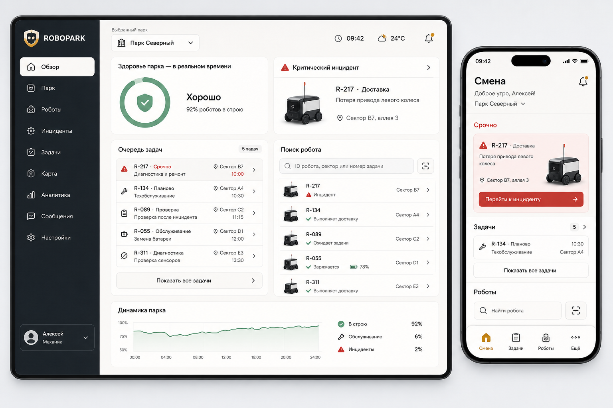
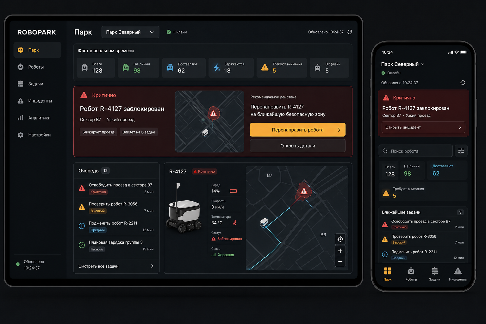

# Robopark: полный продуктовый и UX/UI-редизайн

Статус: утверждено пользователем 2 сентября 2026 года

Тип изменения: архитектурная переработка интерфейса и продуктовых сценариев

Стратегия: поэтапная пересборка по доменам с сохранением стабильного API

## 1. Контекст

Robopark уже поддерживает несколько ролей, работу с парками, задачами Tracker, проверку роботов, репорты, аналитику и административные операции. Однако текущий интерфейс вырос без единой продуктовой модели:

- один маршрут `/tasks` показывает принципиально разные продукты в зависимости от роли;
- права, роли, статусы согласования и маршруты проверяются в нескольких слоях;
- выбранные задачи, фильтры и вкладки часто не восстанавливаются после обновления страницы;
- рабочая панель задачи реализована несколькими дублирующими компонентами;
- административные функции собраны в крупные смешанные экраны;
- часть маршрутов является скрытыми заглушками;
- адаптивность существует, но несколько ключевых экранов переключаются одним резким breakpoint;
- есть нарушения контраста, клавиатурной доступности диалогов и размеров touch-target;
- аналитика частично дублирует обзор, а критичные данные не всегда показывают свежесть и источник.

Редизайн должен изменить не только внешний вид, но и информационную архитектуру, ролевые сценарии, навигацию, состояния ошибок и структуру фронтенда.

## 2. Зафиксированные решения

1. Продукт пересобирается поэтапно внутри существующего репозитория; полный rewrite серверной части не требуется.
2. Стабильные API сохраняются. Новые серверные возможности добавляются только там, где интерфейс не может быть честно реализован на текущих данных.
3. Robopark получает оригинальную айдентику, вдохновлённую автономными роботами-доставщиками, без логотипов, копирования фирменной геометрии, шрифтов и узнаваемых коммерческих силуэтов Яндекса.
4. Основной UX-принцип: **«состояние → риск → следующее действие»**.
5. Приложение остаётся единым и полностью функциональным на ПК и телефоне. Роли меняют приоритет и плотность представления, но не лишаются разрешённых возможностей.
6. Для механиков и водителей приоритетны полевые мобильные сценарии; для операторов и администраторов — плотная работа на ПК. При этом механик полноценно работает с ПК, а оператор и администратор — с телефона.
7. В пользовательском интерфейсе термин «Аварийный режим» заменяется на **«Проверка робота»**.
8. Светлая и тёмная темы являются равноправными вариантами одной дизайн-системы.
9. Фотографии роботов предоставит владелец проекта. Интерфейс не должен зависеть от наличия изображения и всегда показывает текстовый идентификатор и состояние.

## 3. Цели

- Дать пользователю понять состояние парка или робота и найти следующее действие за несколько секунд.
- Сократить число переходов до главной операции каждой роли до двух.
- Сделать рабочий контекст восстанавливаемым и пригодным для прямых ссылок.
- Устранить дублирование рабочих интерфейсов и разрозненную логику доступа.
- Обеспечить полноценную доступность, адаптивность и две темы.
- Оставлять рабочее демо после каждого этапа миграции.
- Сделать административные и опасные операции предсказуемыми и проверяемыми.

## 4. Не входит в первый цикл

- Полная замена backend-архитектуры.
- Диспетчерская карта без подтверждённого продуктового сценария.
- Отдельное нативное приложение для iOS или Android.
- Полноценная офлайн-синхронизация команд с разрешением конфликтов.
- Push-уведомления до проектирования событийного backend-сервиса.
- SLA и исторические метрики, которых ещё нет в достоверных серверных данных.
- Окончательные изображения роботов до передачи исходных фотографий.

## 5. Информационная архитектура

### 5.1 Основные разделы

| Раздел | Назначение |
| --- | --- |
| Смена / Обзор | Состояние парка или доступной области, срочные риски и рекомендуемые действия |
| Работа | Очереди, блокеры, назначенные задачи и единая карточка задачи |
| Роботы | Поиск, недавние роботы, карточка робота, история и переход к проверке |
| Проверка робота | Состояние связи и телеметрии, местоположение, диагностика и управляемое восстановление |
| Репорты | Создание, входящая очередь, обработка, вложения, статусы и SLA |
| Аналитика | Тренды, повторяемость, SLA и сравнение парков без дублирования обзора |
| Управление | Парки, люди, роли, интеграции, безопасность, конфигурация проверки и система |

### 5.2 Канонические маршруты

- `/overview`
- `/work`
- `/work/:issueKey`
- `/robots`
- `/robots/:vin`
- `/robots/:vin/check`
- `/reports`
- `/reports/new`
- `/reports/:reportId`
- `/analytics`
- `/admin/parks`
- `/admin/access`
- `/admin/roles`
- `/admin/integrations`
- `/admin/safety`
- `/admin/robot-check`
- `/admin/system`
- `/account`

Старые маршруты сохраняются как временные перенаправления. В частности, `/emergency` и ссылки с его query-параметрами должны переводиться в `/robots/:vin/check` без потери выбранного робота и вкладки.

### 5.3 Правила навигации

- На ПК используется боковая навигация с группами «Операции», «Взаимодействие», «Аналитика» и «Управление».
- На телефоне отображаются три-четыре главных пункта для роли и отдельное быстрое действие поиска/сканирования робота.
- Вторичные разрешённые разделы доступны через «Ещё»; они не исчезают из продукта.
- «Карта», «Обучение» и пустая «Помощь» не показываются как рабочие разделы до появления полезного содержимого.
- Проверка робота доступна из глобального поиска, карточки робота и связанной задачи, а не требует знания отдельного технического маршрута.
- Выбранный парк всегда подписан рядом с данными. Экраны с другим scope явно объясняют, почему глобальный выбор парка к ним не применяется.

### 5.4 Ролевые стартовые экраны

| Роль | Главный вопрос экрана | Приоритетные действия |
| --- | --- | --- |
| Механик | Что требует моего внимания в текущей смене? | Открыть срочную задачу, проверить робота, продолжить работу, ответить на возвращённый репорт |
| Оператор | Что мешает работе выбранного парка? | Разобрать блокер, найти робота, открыть текущий отчёт, обработать репорт |
| Водитель | Можно ли безопасно продолжать работу с роботом? | Найти/сканировать робота, выполнить проверку, открыть инструкцию |
| Администратор | Что мешает людям и системе работать корректно? | Исправить конфигурацию, обработать доступ, проверить интеграцию |
| Владелец | Где находится главный риск по всем паркам? | Перейти к критическому парку, оценить тренд, открыть системную операцию |

## 6. Экранная модель

### 6.1 Вход, регистрация и доступ

- Единый спокойный auth-layout без рабочей навигации.
- Роль выбирается карточками с понятным описанием будущего доступа.
- Требования к паролю и его сила видимы до отправки.
- Pending-экран показывает, что именно ожидается, время последнего обновления, доступный контакт и ручное обновление статуса.
- Rejected-экран объясняет состояние и возможный следующий шаг без ложного обещания автоматического пересмотра.
- Механик без парка получает понятный путь назначения, а не только выход.
- Принудительная смена пароля сохраняется как блокирующий сценарий.

### 6.2 Смена / Обзор

Порядок блоков фиксирован смыслом, а не одинаковой сеткой карточек:

1. область работы и свежесть данных;
2. общее состояние;
3. критические риски;
4. одно рекомендуемое следующее действие;
5. очередь ближайшей работы;
6. вторичные показатели и тренды.

На ПК одновременно видны состояние и очередь. На телефоне первым экраном помещаются область работы, критический риск и основное действие. Ролевые варианты используют одни компоненты, но разные источники и порядок блоков.

### 6.3 Работа

- Один `IssueWorkbench` обслуживает все Tracker-сценарии.
- На широком экране используются список и детальная панель; дополнительная колонка допускается только при доказанной пользе.
- На телефоне задача открывается отдельным экраном с понятным возвратом к сохранённой позиции списка.
- Фильтры, сортировка, выбранная задача и пагинация сериализуются в URL.
- Доступные действия выводятся из возможностей задачи и пользователя, а не из названия страницы.
- Опасные действия имеют подтверждение, результат и запись в историю.
- Состояния «нет задач», «очередь не настроена», «нет доступа» и «ошибка загрузки» не смешиваются.

### 6.4 Роботы

- Глобальный поиск принимает номер, VIN и поддерживаемый deep link.
- На телефоне предусматривается сканирование камерой; ручной ввод всегда остаётся доступным.
- Недавние роботы имеют видимый срок, возможность очистки и привязку к пользователю, чтобы не смешивать контекст на общем устройстве.
- Карточка робота показывает идентификатор, фотографию или схему, парк/scope, связь, свежесть, текущую работу и последние события.
- Статус никогда не определяется только фотографией или цветом.

### 6.5 Проверка робота

- Это отдельный полноэкранный, спокойный и мобильный-first сценарий.
- Первый уровень: робот, связь, свежесть, местоположение, критическая причина и одно главное действие.
- Второй уровень: карта, телеметрия, схема и динамические диагностические разделы.
- Вкладки имеют корректную клавиатурную модель и адресуемое URL-состояние.
- Обновление останавливается в неактивной вкладке и возобновляется осознанно.
- Всегда доступны timestamp и ручное обновление.
- «Робот офлайн» и «устройство пользователя без сети» визуально и текстово различаются.
- При ограничении scope интерфейс объясняет причину и допустимое дальнейшее действие.

Внутренние API `/emergency/*` могут временно сохранять техническое имя; оно не должно проникать в пользовательские тексты.

### 6.6 Репорты

- Интерфейс строится вокруг входящей очереди и постоянной детальной области.
- Очередь поддерживает фильтры по статусу, возрасту, парку, ответственному и SLA, когда эти данные доступны.
- Создание на телефоне поддерживает фотографии и вложения, локальный черновик и восстановление после сетевого сбоя.
- Карточка показывает жизненный цикл, владельца, timeline действий и доступные переходы.
- Возврат, эскалация и завершение требуют явного комментария там, где это необходимо процессу.
- UI не обещает назначения или SLA до появления соответствующей серверной модели.

### 6.7 Аналитика

- Текущая placeholder-аналитика и дублирующие overview-KPI удаляются.
- Раздел появляется в навигации только при наличии полезных данных.
- Приоритет: SLA, повторяемые неисправности, динамика блокеров, сравнение парков и причины пропусков данных.
- Каждый график имеет текстовое резюме, единицы измерения и состояние неполных данных.

### 6.8 Управление

Монолитная вкладка разбивается на независимые URL-модули:

- «Парки» — готовность, feature flags, заявки и конфигурация;
- «Люди и доступ» — ожидание, пользователи, согласование и блокировки;
- «Роли» — права, создание и изменение ролей;
- «Интеграции» — подключение и диагностика без лишнего раскрытия секретов;
- «Безопасность» — политика, screenshot guard и аудит;
- «Конфигурация проверки» — секции и поля проверки робота;
- «Система» — резервные копии, обновления и другие высокорисковые операции.

На телефоне списки становятся карточками и пошаговым редактированием. Возможности не удаляются, но сверхплотные массовые операции могут получать предупреждение «удобнее на большом экране». Высокорисковые операции изолируются, требуют точного подтверждения и показывают результат.

### 6.9 Контекстная помощь

- Общая пустая страница помощи не нужна.
- Инструкции и контакты располагаются рядом с конкретной ошибкой, проверкой или административной операцией.
- Отдельный раздел может вернуться позже как набор проверенных operational runbooks.

## 7. Визуальная система Robopark Operational

### 7.1 Направление

Система соединяет тёплый светлый operational-minimalism и спокойный тёмный Night Ops. Это не две разные темы и не усреднённый серый стиль: структура, размеры, иерархия, семантика и интерактивные состояния совпадают.

[Отклонённое исследовательское направление: модульная бело-жёлтая тема](assets/robopark-redesign/rejected-modular-exploration.png) сохраняется только как журнал принятого решения и не является источником визуальной спецификации.

Макеты являются направлением, а не pixel-perfect заданием. Изображения роботов в них временные и не должны переноситься в продукт.

### 7.2 Темы

- Выбор: «Системная», «Светлая», «Тёмная».
- Предпочтение сохраняется для пользователя; до загрузки профиля допускается локальный bootstrap без вспышки неверной темы.
- Светлая тема: тёплый нейтральный canvas, белые рабочие поверхности, графитовый текст, янтарное действие.
- Тёмная тема: глубокий графитовый canvas, сланцевые поверхности, тёплый белый текст и тот же янтарный смысловой акцент.
- Карты, графики, skeleton, overlay и focus-состояния имеют полноценные варианты обеих тем.

### 7.3 Семантические токены

Минимальный слой токенов:

- `canvas`, `surface`, `surface-elevated`, `surface-sunken`;
- `text`, `text-muted`, `text-inverse`, `border`, `divider`;
- `action`, `action-on`, `action-hover`, `focus`;
- `critical`, `critical-on`, `warning`, `success`, `info`;
- state layers для hover, selected, disabled и pressed;
- типографика, расстояния, радиусы, тени и motion.

Янтарная кнопка использует тёмный текст, если белый не обеспечивает контраст. Красный зарезервирован для критического риска; зелёный — для исправного состояния; синий — для информации. Цвет всегда дублируется иконкой, подписью или формой.

### 7.4 Типографика и геометрия

- Основной шрифт: один self-hosted variable sans-serif; текущий Manrope допустим после проверки начертаний и кириллицы.
- Числа в метриках и идентификаторы используют tabular numerals.
- Основной текст и controls: не менее 14 px; supplementary metadata: не менее 12 px; мобильные form controls: не менее 16 px.
- Базовая шкала отступов: 4, 8, 12, 16, 24, 32 px.
- Pill-форма используется для коротких статусов, а не для каждого контейнера.
- Карточки и панели имеют промышленную, но мягкую геометрию с ясными стыками и без декоративного стекломорфизма.

### 7.5 Иконки, изображения и motion

- Unicode-глифы навигации заменяются одной SVG-системой.
- Для робота, сенсоров и проверки создаются оригинальные дополнительные glyphs.
- Фотографии роботов используют предсказуемое кадрирование, нейтральный фон, `object-fit` и текстовый alt/идентификатор.
- При отсутствии фото используется оригинальная нейтральная схема.
- Motion длится примерно 120–200 мс и объясняет изменение состояния; `prefers-reduced-motion` полностью поддерживается.

## 8. Адаптивность и плотность

Режимы задаются намерением, а не одним breakpoint:

| Режим | Ширина | Поведение |
| --- | ---: | --- |
| Compact phone | до 599 px | Последовательные экраны, bottom navigation, sticky primary action |
| Phone / tablet | 600–899 px | Более широкие карточки, адаптивные toolbars, без принудительного split-view |
| Split tablet | 900–1199 px | Выборочный split-view с приоритетом контента и сворачиваемой навигацией |
| Desktop | от 1200 px | Боковая навигация, рабочие панели и управляемая плотность |

Правила:

- интерактивная зона не меньше 44×44 px;
- на 320 px нет горизонтального скролла основного layout;
- таблицы на телефоне превращаются в смысловые карточки, а не просто прокручиваются по горизонтали;
- desktop позволяет «Комфортную» и «Компактную» плотность;
- phone всегда использует комфортную плотность;
- основное действие остаётся доступным без прокрутки длинной формы или детали, если это безопасно.

## 9. Компонентная и фронтенд-архитектура

### 9.1 Слои

- `app`: bootstrap, providers, RouteManifest, shell и глобальные overlays;
- `design-system`: tokens, primitives, patterns и accessibility contracts;
- `domains/shift`, `domains/work`, `domains/robots`, `domains/reports`, `domains/analytics`, `domains/administration`;
- `shared`: API transport, типы, query/cache adapter, formatters и общие utilities.

Точные имена директорий могут быть скорректированы implementation-планом, но границы ответственности сохраняются.

### 9.2 RouteManifest и доступ

Одна декларативная запись маршрута содержит:

- canonical path и legacy aliases;
- пользовательское название и SVG-иконку;
- необходимые capability/permissions;
- prerequisite состояния пользователя;
- role-specific presentation variant;
- desktop/mobile navigation priority;
- fallback или landing behavior.

Из manifest строятся router, навигация, guards и выбор стартового экрана. Backend остаётся источником истины для авторизации; manifest отвечает за последовательное представление, а не за безопасность API.

### 9.3 Общие паттерны

- `IssueWorkbench` — список, деталь, действия и URL-состояние задачи;
- `RobotResolver` — поиск/сканирование и нормализация результата;
- `RobotCheckWorkspace` — snapshot, freshness, map, schema и section data;
- `ReportWorkspace` — очередь, деталь, composer и lifecycle actions;
- `AccessPolicy` — производные возможности интерфейса;
- `AsyncState` — loading, empty, failure, stale и retry;
- единый dialog/bottom-sheet primitive с focus trap, inert background, scroll lock, Escape policy и восстановлением focus;
- единый destructive-confirmation pattern с явным scope и результатом.

## 10. Поток данных

1. Приложение загружает session и серверные permissions.
2. RouteManifest вычисляет доступный landing и навигацию.
3. Park context выбирает явную область данных; park-independent экраны помечают свой scope отдельно.
4. Domain controller читает URL-состояние и формирует запрос.
5. API response преобразуется в typed view model с `updatedAt`, freshness и capability actions.
6. Экран показывает данные или одно из определённых состояний восстановления.
7. После mutation инвалидируются только связанные ресурсы; глобальный прогресс не должен маскировать локальный результат.

Безопасные и обратимые изменения могут использовать optimistic UI. Критические, административные и внешние операции подтверждаются сервером до показа успешного состояния.

## 11. Ошибки, сеть и свежесть

Единая классификация:

| Класс | Представление | Действие |
| --- | --- | --- |
| Нет сети у пользователя | Persistent offline banner, сохранённые данные помечены устаревшими | Повторить, сохранить допустимый черновик |
| Робот офлайн | Статус конкретного робота с последним временем связи | Открыть инструкцию или повторить проверку |
| Нет прав | Объяснение недоступного scope без утечки данных | Вернуться или запросить доступ, если процесс существует |
| Парк не настроен | Readiness-проблема с конкретной причиной | Перейти к доступной настройке или контакту владельца |
| Нет данных | Нормальное empty-state, не ошибка | Создать/изменить фильтр, если применимо |
| Конфликт | Данные изменены другим пользователем | Перезагрузить и повторно принять решение |
| Серверная ошибка | Локальная ошибка с trace/request id при наличии | Повторить или передать идентификатор поддержке |

Polling проверки робота и maintenance должен учитывать видимость вкладки, backoff и ручное обновление. Пользователь всегда видит, насколько свежи данные.

## 12. Доступность

- WCAG AA для text-bearing combinations.
- Полноценная клавиатурная навигация и видимый focus не слабее 2 px.
- Корректная модель `tablist`/`tab`/`tabpanel` с roving focus.
- Диалоги управляют начальным focus, trap, Escape, inert background и возвратом focus.
- Loading/success получают `aria-live`; action failures — `role=alert`.
- Графики имеют текстовое резюме и не требуют различения только цвета.
- Touch-target не меньше 44×44 px, включая hotspots схемы робота.
- Контент остаётся понятным при 200% zoom и в reduced motion.

## 13. Миграция

### Этап 0. Стабилизация

- Зафиксировать рабочие role fixtures и критические journeys.
- Исправить уже диагностированный ответ `500` вместо `401` на неавторизованном `/auth/me`.
- Добавить тестируемую матрицу роль × статус × permission × route.

### Этап 1. Фундамент

- Семантические токены, светлая/тёмная темы и SVG-иконки.
- Адаптивный AppShell, RouteManifest, парк и глобальный RobotResolver.
- Общие dialogs, sheets, async и destructive patterns.

### Этап 2. Операционная работа

- Ролевой Смена/Обзор.
- IssueWorkbench и новые маршруты `/work`.
- Роботы и Проверка робота.
- URL persistence и legacy redirects.

### Этап 3. Репорты и аналитика

- Inbox-first ReportWorkspace.
- UI существующих вложений, черновики и восстановление.
- Полезная аналитика только на подтверждённых данных.

### Этап 4. Доступ и управление

- Onboarding и статусы согласования.
- Модульные admin routes.
- Аудит и единые критические подтверждения.

### Этап 5. Очистка

- Удаление старых дублирующихся компонентов и мёртвых стилей.
- Удаление завершённых compatibility adapters.
- Обновление README и продуктовой документации.

Каждый этап должен быть отдельно проверяемым, коммититься небольшими логическими изменениями и оставлять рабочее демо.

## 14. Проверка и критерии приёмки

### 14.1 Автоматические проверки

- Unit-тесты RouteManifest, AccessPolicy, URL-state и domain transformations.
- Табличные тесты для каждой комбинации ключевых ролей, статусов и permissions.
- Component-тесты keyboard/focus/dialog/tab/error/retry flows.
- E2E journeys для механика, оператора, водителя, администратора и владельца.
- Accessibility-тесты и автоматический axe-аудит.
- Visual regression для светлой и тёмной темы на 320, 390, 768, 1024 и 1440 px.
- Проверки offline, stale, timeout, 401, 403, 404, 409 и 5xx состояний.

### 14.2 Продуктовые критерии

- Главная операция каждой роли доступна максимум за два перехода.
- На 320 px нет горизонтального скролла основного интерфейса.
- Все интерактивные цели не меньше 44×44 px.
- Обычный текст и controls соответствуют утверждённому минимуму.
- Все текстовые сочетания проходят WCAG AA.
- Светлая, тёмная и системная темы переключаются без потери контекста и визуальной вспышки.
- Выбранный парк, фильтр, задача, робот, репорт и вкладка восстанавливаются из URL.
- Статус не кодируется только цветом.
- Данные проверки робота всегда имеют видимую свежесть.
- После каждого этапа доступны рабочее демо и пройденные проверки затронутых сценариев.

## 15. Риски и способы контроля

- **Скрытая зависимость UI от role branches.** Контроль: сначала RouteManifest и матричные тесты.
- **Смешение старой и новой дизайн-систем.** Контроль: мигрировать цельными доменами, не отдельными случайными карточками.
- **Обещание несуществующих данных.** Контроль: не выводить SLA, историю или telemetry freshness без server contract.
- **Рост bundle из-за второй темы и изображений.** Контроль: темы на CSS variables, responsive image formats и lazy loading.
- **Поломка прямых ссылок.** Контроль: таблица legacy redirects и E2E deep-link tests.
- **Риск торговой марки.** Контроль: оригинальная иконография, фотографии от владельца и отсутствие брендовых активов Яндекса.
- **Большой объём изменения.** Контроль: этапы с независимой проверкой и рабочим демо.

## 16. Открытые входные материалы

- Фотографии роботов от владельца проекта.
- Подтверждение прав на их использование и желаемые варианты кадрирования.
- Реальные ожидания SLA и ответственных, если они должны стать частью серверной модели.
- Продуктовое решение по будущей карте/диспетчеризации и push-уведомлениям после завершения основных рабочих сценариев.

Эти материалы не блокируют фундамент, RouteManifest, дизайн-систему и миграцию существующих рабочих сценариев.
